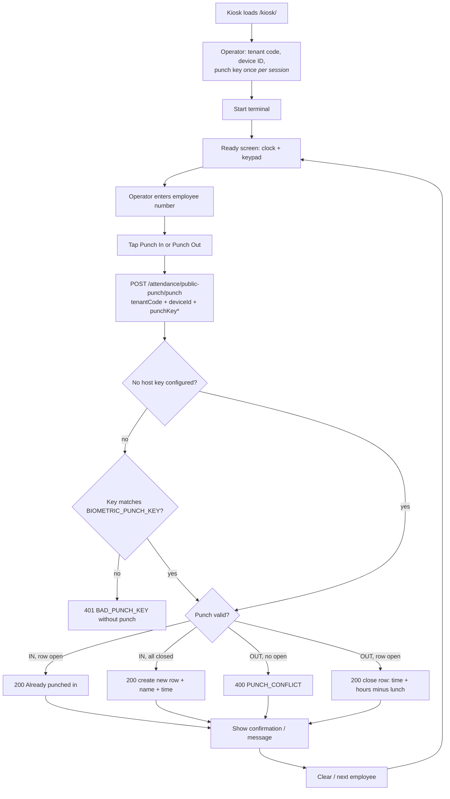

# Attendance Kiosk — Standalone Lobby Terminal

## Purpose

A **login-less, full-screen attendance terminal** for the office lobby. It exists
as its own tiny React app (`kiosk/`) so a real device/terminal can sit at the door
and let employees punch IN/OUT without needing an HRMS account or the main SPA.

It is deliberately scoped to **punch + confirmation**:

- big Asia/Manila clock + date,
- employee-number entry (on-screen keypad + physical keyboard),
- Punch In / Punch Out,
- confirmation showing the employee's **name**, punch **time**, and **today's hours**
  on punch-out.

No roster, no PII browsing, no history — just the transaction each punch leaves
behind. Anything more is out of scope for a lobby screen.

## Workflow



Plain-text equivalent of the same flow:

```
kiosk page ──> terminal setup (tenant, device, optional key in memory)
    │
    └─ Start ──> Ready: clock + big keypad
                     │
    enter employee number
    tap Punch In / Punch Out
         │
         v
    POST /api/v1/attendance/public-punch/punch
    { employeeNumber, punchType, tenantCode, deviceId, punchKey? }
         │
         ├─ 401 BAD_PUNCH_KEY      (key required & wrong/missing)
         ├─ 400 PUNCH_CONFLICT     (OUT with no open row / no punch today)
         ├─ 200 Already punched in (IN while a row is open)
         └─ 200 success            (record + employee name + time; hours on OUT)
```

## Security posture

- The endpoint is **unauthenticated by design** (a door terminal has no session).
  Authorization is borrowed from a real-world DTR device:
  - **Shared punch key** — set `BIOMETRIC_PUNCH_KEY` in `backend/.env` on the
    server and only terminals that present it (timing-safe compare) can punch.
    Leave it unset to run an open kiosk (fine for an internal LAN lobby screen).
  - **Rate limit** — `punchLimiter` (120/min/IP) on the public route.
  - **Tenant isolation** — `tenantCode` selects the tenant; the employee is looked
    up *within that tenant* only.
- The punch key lives only in the kiosk's React state; it is **never** written to
  localStorage and is gone on reload/End Session.
- Punch responses reveal the employee's name — acceptable because it is the
  employee's own confirmation on a lobby screen. Do not add roster reads here.

## Setup & run

```bash
# dev (kiosk on :5176, /api proxied to backend on :4000)
cd kiosk
npm install
npm run dev        # http://localhost:5176/kiosk/

# prod build  -> kiosk/dist (base /kiosk/)
npm run build
```

Optional `kiosk/.env` value:

```
VITE_API_BASE="/api/v1"            # default; same-origin via nginx
```

## Deployment (nginx)

Serve the built `kiosk/dist` under its own path and proxy the API to the backend
— same origin, so **no CORS** is needed:

```nginx
# inside the HRMS server block
location /kiosk/ {
    alias /srv/lgu-hrms/kiosk/dist/;
    try_files $uri $uri/ /kiosk/index.html;
}

location /api/ {
    proxy_pass http://127.0.0.1:4000;
    proxy_set_header X-Forwarded-For $remote_addr;   # keep allowlist accurate
}
```

## Files

| Path | Role |
| --- | --- |
| `kiosk/package.json` | deps: react, react-dom, vite, plugin-react only |
| `kiosk/vite.config.js` | `base: /kiosk/`, dev `/api` proxy → :4000, port 5176 |
| `kiosk/src/api.js` | single `punch()` client against the public endpoint |
| `kiosk/src/App.jsx` | terminal setup + ready screen + punch flow (all in-memory state) |
| `kiosk/src/index.css` | compact design-token stylesheet (no UI kit, no Tailwind) |
| `kiosk/src/main.jsx` | React root |
| `kiosk/.env.example` | `VITE_API_BASE` documentation |
| `backend/src/...` | unchanged public punch API (name now echoed in responses) |

## Backend contract touched

`POST /api/v1/attendance/public-punch/punch` — the punch response now includes
`record.employee` (`firstName`, `lastName`, `employeeNumber`) so the kiosk can
render a name confirmation. See `backend/src/services/attendanceService.js`
`PUNCH_WITH_EMPLOYEE`.