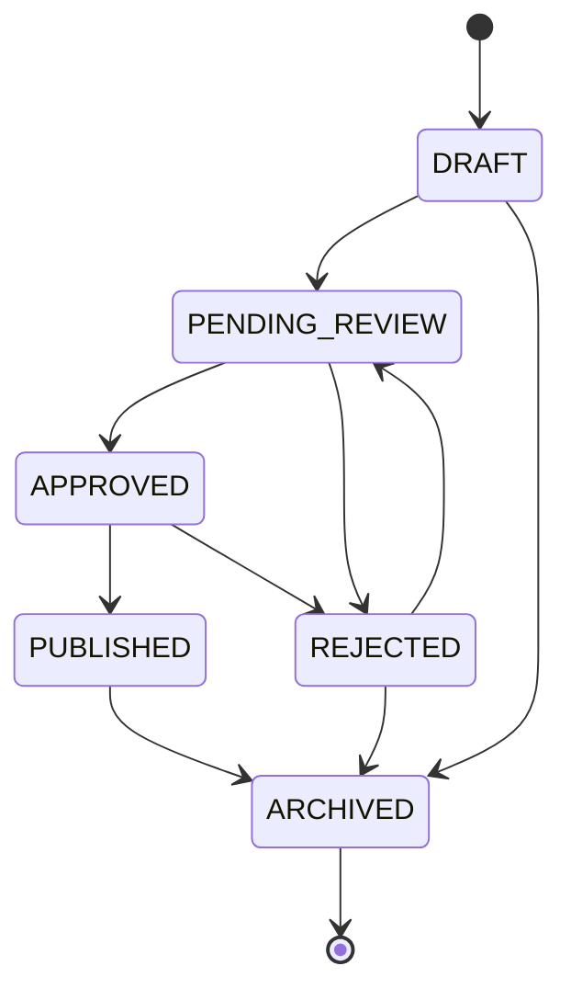
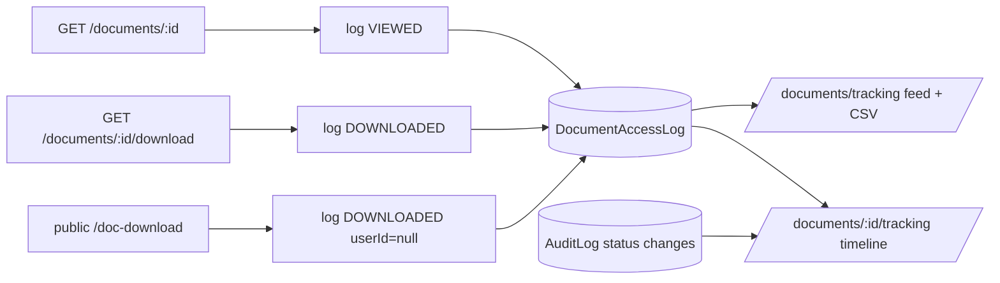

# Document Tracking & Management System (DTMS)

## Overview
Tenant-scoped document store with an approval/publishing workflow, optional file upload, and
an optional link to an employee (201 file). Admins/HR manage documents; staff can download;
published documents can be fetched from a login-less, tenant-scoped portal endpoint.

- Frontend page: `frontend/src/pages/Documents.jsx` → `/documents` (Administration group)
- API client: `frontend/src/api/documents.js`
- Backend: `backend/src/routes/documents.js` → `controllers/documentController.js` → `services/documentService.js` → `repositories/documentRepository.js`
- Schema: `Document` (`backend/prisma/schema.prisma:1184`), enums `DocumentType` / `DocumentStatus`
- Capability: `documentsCRUD` (ADMIN, HR_MANAGER, SUPER_ADMIN by default)

## Roles & capability
| Layer | Rule |
|---|---|
| Capability | `documentsCRUD` gates all writes (`POST`/`PATCH`/`DELETE`/status). Reads require auth only. `documentsTrack` gates the tracking feed/export/timeline (ADMIN/HR_MANAGER/AUDITOR). `SUPER_ADMIN` bypasses. |
| Transition roles | `PENDING_REVIEW` → any capability holder; `APPROVED`, `REJECTED`, `PUBLISHED` → ADMIN/HR_MANAGER/SUPER_ADMIN; `ARCHIVED` → ADMIN/SUPER_ADMIN. Enforced in `documentRepository.setStatus` (single source of truth alongside the workflow map). |
| Tenant | Reads use `withTenant`; writes use `stampTenant`; cross-tenant writes fail `403 TENANT_FORBIDDEN`. |

## Status workflow

- Transitions are validated in `documentRepository.setStatus` (`INVALID_TRANSITION` → `409`).
- On `PUBLISHED` the repo stamps `publishedBy`/`publishedAt`.
- `DELETE /documents/:id` is a **soft delete** → delegates to the `ARCHIVED` transition (workflow + role gate), never a hard delete.
- `ARCHIVED` is terminal.

## Endpoints
| Method | Path | Auth | Notes |
|---|---|---|---|
| GET | `/documents` | JWT | Paginated `{items,total,page,limit}`, filters `type`/`status`/`employeeId`/`search`, cap 100 |
| GET | `/documents/stats` | JWT | Counts per status (rendered as cards on the Documents page) |
| GET | `/documents/:id` | JWT | Tenant-scoped; logs `VIEWED` access |
| GET | `/documents/:id/download` | JWT | Streams the stored file (any status); logs `DOWNLOADED` access |
| GET | `/documents/tracking` | `documentsTrack` | Access feed, filters `documentId`/`userId`/`action`/`from`/`to`, paged |
| GET | `/documents/tracking/export` | `documentsTrack` | CSV of access events (same filters) |
| GET | `/documents/:id/tracking` | `documentsTrack` | Merged access + workflow status timeline |
| POST | `/documents` | `documentsCRUD` + multipart | Optional `file`; defaults `status=DRAFT` |
| PATCH | `/documents/:id` | `documentsCRUD` + multipart | Optional file replace |
| DELETE | `/documents/:id` | `documentsCRUD` | Archive (soft delete) |
| PATCH | `/documents/:id/status/:status` | `documentsCRUD` | Workflow transition + role gate |
| GET | `/doc-download/:id/download` | none (pre-auth) | PUBLISHED only; tenant resolved from subdomain, fail-closed |

## File storage & download security
- Multer disk storage → `uploads/documents/`, 25 MB limit, MIME allowlist (`backend/src/middleware/upload.js`); the DB stores `url` = `uploads/documents/<file>` (relative, no leading slash), `fileSize` (bytes), `mimeType`. Migration `20260917060000_document_access_log` strips a legacy leading `/` from existing rows.
- **No static `/uploads` mount.** Files are only served through the API, which enforces tenant scope and (for the public route) `status === 'PUBLISHED'`. Downloads also cap to published-only on the public path via `req.publicDownloadOnly`.
- `resolveFilePath` strips a leading `/` before resolving against `process.cwd()` (a leading slash would resolve to the drive root on Windows, causing `FILE_MISSING`).

## Frontend behaviour
- Filters (type/status/search), table, pagination (20/page), create/edit modal with file input, status-transition buttons that mirror the workflow map and role gates, blob download, and an Archive action.
- The type dropdown is generated from the enum values shared with the backend; keep it in sync with `DocumentType`.

## Access tracking (M4)
Reads/downloads were previously invisible (`AuditLog` only records writes). Every
`get`/`download` now appends an append-only `DocumentAccessLog` row
(`VIEWED`/`DOWNLOADED`; the pre-auth public download logs `userId=null`, shown as
"Public"). `documentService.logAccess` is best-effort — a failed insert is caught and
sent to stderr, never affecting the response.

Reading the feed requires the new `documentsTrack` capability (ADMIN + HR_MANAGER +
AUDITOR by default; SUPER_ADMIN bypasses). The UI is `pages/DocumentsTracking.jsx`
under the collapsible **Documents** sidebar group, with an action/date filter, a
per-document **Timeline** modal, and **Export CSV**. `AuditLog` rows carry no
`tenantId`, so the timeline scopes workflow events by `documentId` with a
`tenantId ∈ {req.tenantId, null}` guard (workaround tracked in `TODOS.md`).

## Verification
Live E2E (admin + HR_MANAGER + AUDITOR): create with upload → list returns the item → authenticated download returns file bytes → `DRAFT→APPROVED` rejected `409` → valid transitions `200` → public download `404` for DRAFT/ARCHIVED and `200` for PUBLISHED under the correct tenant subdomain → `DELETE` archives (`204`) and a repeat `DELETE` is `409`; HR_MANAGER can publish but not archive (`403`); AUDITOR is blocked by capability (`403`).
M4 E2E: `VIEWED`/`DOWNLOADED` rows written and actor-enriched, feed filters
(action/date) work, CSV export returns headers, timeline merges ACCESS + WORKFLOW,
AUDITOR allowed, EMPLOYEE `403` on the feed but still reads documents, public
download `200`/`404` by subdomain and logs a null-user row (16/16 + subdomain checks).

## Known gaps (not yet done)
See `TODOS.md` → "DTMS remaining". M4 is shipped; the remaining larger features are
decomposed into shippable module specs in
[`modules/dtms/README.md`](modules/dtms/README.md): M1 taxonomy & folders,
M2 version history, M3 routing & assignment, M5 retention & disposal,
M6 notifications & escalation, M7 e-signature, plus the phase-0 housekeeping
backlog (remaining: document seed data, stale benchmark docs).
