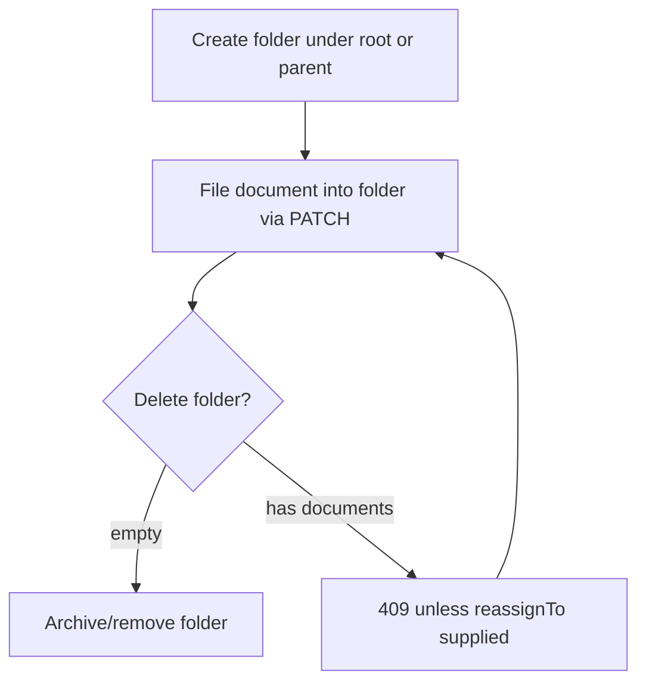

# DTMS-M1 — Taxonomy & Folders

- **Status:** Proposed
- **Phase:** 1
- **Depends on:** Housekeeping (storage path + seed)
- **Capabilities:** `documentsCRUD` (reuse); folder-visible reads stay auth-only
- **Touches:** schema, migration, contract, repository, service, controller, routes, seed, `Documents.jsx`

## Why
All documents currently live in one flat list filtered only by `type` and free-text
`tags`. Real records management needs an organizing structure: a records **series**
(what kind of record, tied to a retention rule in M5) and **folders** (where it is
filed). This is the prerequisite for retention (M5) and makes routing (M3) findable.

## Scope
### In
- Self-referential folder tree, per tenant.
- Optional `seriesCode` on a document (short controlled code, e.g. `HR-PERS`, `HR-LEAVE`).
- List/filter by folder and series; folder tree sidebar in the UI.
### Out
- Cross-tenant/shared folders.
- Per-folder ACLs (inherits `documentsCRUD`).
- File moves on disk (folder is metadata only).

## Data model (proposed Prisma)
```prisma
model DocumentFolder {
  id        String   @id @default(uuid())
  tenantId  String
  name      String
  parentId  String?
  sortOrder Int      @default(0)
  createdAt DateTime @default(now()) @db.Timestamptz(6)
  updatedAt DateTime @updatedAt @db.Timestamptz(6)

  parent    DocumentFolder?  @relation("FolderTree", fields: [parentId], references: [id])
  children  DocumentFolder[] @relation("FolderTree")
  documents Document[]
  tenant    Tenant           @relation(fields: [tenantId], references: [id])

  @@unique([tenantId, parentId, name])
  @@index([tenantId, parentId])
}

model Document {
  // ...existing fields
  folderId   String?
  seriesCode String?
  folder     DocumentFolder? @relation(fields: [folderId], references: [id])

  @@index([tenantId, folderId])
  @@index([tenantId, seriesCode])
}
```

## API
| Method | Path | Gate | Notes |
|---|---|---|---|
| GET | `/document-folders` | auth | Flat list (tenant-scoped) |
| GET | `/document-folders/tree` | auth | Nested `{ id, name, children[] }` |
| POST | `/document-folders` | `documentsCRUD` | Body `{ name, parentId? }` |
| PATCH | `/document-folders/:id` | `documentsCRUD` | Rename / re-parent (reject cycles) |
| DELETE | `/document-folders/:id` | `documentsCRUD` | 409 if non-empty unless `?reassignTo=` given |
| PATCH | `/documents/:id` | `documentsCRUD` | Accept `folderId`, `seriesCode` (extend existing) |
| GET | `/documents` | auth | New filters `folderId`, `seriesCode` |

## Workflow


## UI
- Left column tree on `/documents` (collapse/expand, "All documents" root, counts).
- Folder + series fields in the create/edit modal.
- Breadcrumb + folder filter chip above the table.

## Tenant / security / audit
- Tree queries filtered by `tenantId`; re-parent validates the target is same-tenant.
- Cycle guard: a folder may not become a descendant of itself.
- Folder CRUD is a mutating endpoint → audited by the global mount.

## Acceptance criteria
- [ ] Folders are tenant-isolated; cross-tenant parent ids fail `403/404`.
- [ ] Re-parent cannot create a cycle.
- [ ] Deleting a non-empty folder returns `409` unless `reassignTo` is valid.
- [ ] `GET /documents?folderId=` returns only that subtree (recursive option).
- [ ] `npm run build` + `node --check` + color lint pass; seed adds a starter tree.
