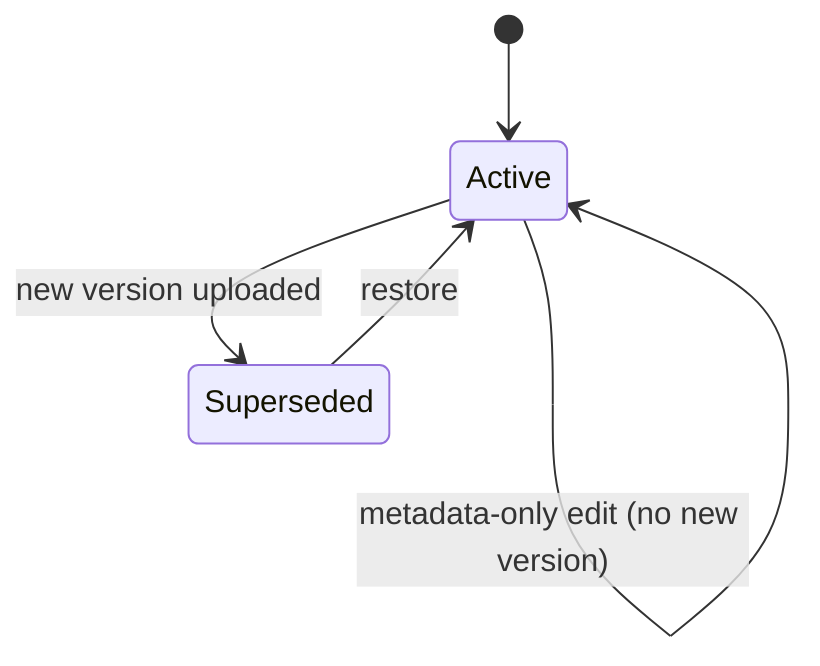

# DTMS-M2 — Version History

- **Status:** Proposed
- **Phase:** 2
- **Depends on:** Housekeeping (normalized storage path)
- **Capabilities:** `documentsCRUD` (reuse)
- **Touches:** schema, migration, contract, repository, service, controller, routes, `Documents.jsx` (versions tab)

## Why
Today `PATCH /documents/:id` with a file **overwrites** `url`/`fileSize`/`mimeType`,
so the previous file is lost and `version` is a free-text label nobody enforces.
A controlled document (policy, office order, MOA) must keep an immutable history of
what was issued, when, and by whom.

## Scope
### In
- Immutable version rows; each new upload appends a version.
- `Document.url` always points at the current (active) version.
- Restore a prior version (creates a new active version pointing at the old file).
- Version list with uploader, timestamp, size, checksum.
### Out
- Visual diff of document contents.
- Automatic file dedup across versions (checksum stored for later).
- Client-side editing.

## Data model (proposed Prisma)
```prisma
model DocumentVersion {
  id         String   @id @default(uuid())
  tenantId   String
  documentId String
  version    String
  url        String
  fileSize   Int?
  mimeType   String?
  checksum   String?
  notes      String?
  createdBy  String?
  createdAt  DateTime @default(now()) @db.Timestamptz(6)

  document Document @relation(fields: [documentId], references: [id], onDelete: Cascade)

  @@unique([documentId, version])
  @@index([tenantId, documentId])
}

model Document {
  // ...existing fields
  currentVersionId String?
  versions         DocumentVersion[]
}
```
`version` numbering: `major.minor` string, default `1.0`; new upload bumps minor
(e.g. `1.1`), a human may pass an explicit value.

## API
| Method | Path | Gate | Notes |
|---|---|---|---|
| GET | `/documents/:id/versions` | auth | Newest first |
| POST | `/documents/:id/versions` | `documentsCRUD` + multipart | File required; appends version + updates `url`/`fileSize`/`mimeType` |
| GET | `/documents/:id/versions/:versionId/download` | auth | Streams that version (not necessarily current) |
| PATCH | `/documents/:id/versions/:versionId/restore` | `documentsCRUD` | Marks prior versions superseded, points `url` at it |

## Workflow

Rule: a file upload always creates a version; metadata-only `PATCH` does not.

## UI
- "Versions" section in the document detail/modal: table of version, size, uploader, date, download, Restore.
- Upload-new-version action separate from edit-metadata.

## Tenant / security / audit
- `DocumentVersion.tenantId` mirrors the parent; repo scopes by `withTenant`.
- Version create writes `stampTenant` + is audited once (global mount).
- Download reuses `resolveFilePath` semantics (auth, tenant-scoped).

## Acceptance criteria
- [ ] Replacing the file creates a version row; the previous file remains downloadable.
- [ ] `Document.url` equals the active version's url after upload and after restore.
- [ ] Version strings are unique per document; duplicates return `409`.
- [ ] Existing documents without versions still read/download (backfill or lazy-create v1).
- [ ] Verify gates pass.
