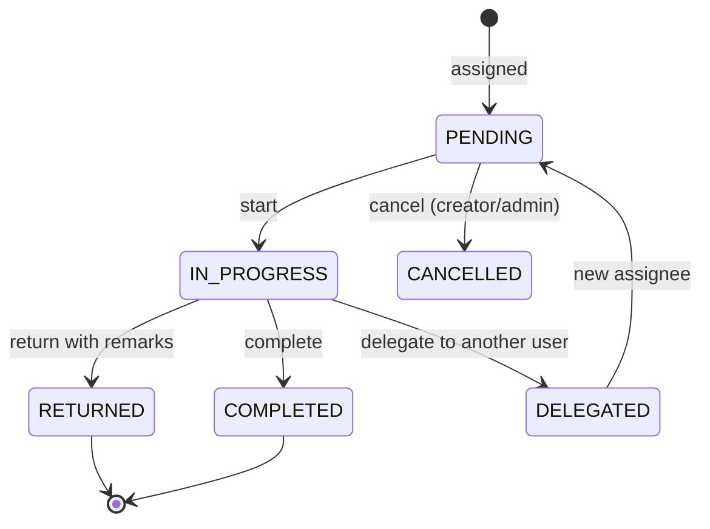

# DTMS-M3 — Routing & Assignment

- **Status:** Proposed
- **Phase:** 2
- **Depends on:** M1 (folders, optional for findability)
- **Capabilities:** `documentRouting` (new; ADMIN + HR_MANAGER default)
- **Touches:** schema, migration, contract, repository, service, controller, routes, permissions, `Documents.jsx` (routes tab), new `DocumentInbox` page

## Why
The existing workflow (`DRAFT → PENDING_REVIEW → APPROVED → PUBLISHED → ARCHIVED`)
is a **state machine**, not a routing system. There is no assignee, no due date, no
"for signature"/"for information", and no personal inbox. PRIME HR and CSC records
management both require routing a record to a person/office for action and proving
who was asked to do what, by when.

## Scope
### In
- Ordered route steps attached to a document, each with an action type, assignee
  (user and/or department), due date, and outcome.
- A "My Document Inbox" (routes assigned to the current user or their department).
- Return/delegate without changing the document's publication status.
### Out
- Automatic branch/conditional routing (parallel/OR gates).
- SLA escalation automation (that is M6).
- Physical custody/location tracking (future module; keep as backlog note).

## Data model (proposed Prisma)
```prisma
enum RouteActionType { FOR_REVIEW FOR_APPROVAL FOR_SIGNATURE FOR_INFO FOR_ACTION }
enum RouteStatus { PENDING IN_PROGRESS COMPLETED RETURNED DELEGATED CANCELLED }

model DocumentRoute {
  id              String          @id @default(uuid())
  tenantId        String
  documentId      String
  stepNo          Int
  actionType      RouteActionType
  assigneeUserId  String?
  assigneeDeptId  String?
  status          RouteStatus     @default(PENDING)
  dueAt           DateTime?       @db.Timestamptz(6)
  completedAt     DateTime?       @db.Timestamptz(6)
  remarks         String?
  createdBy       String?
  createdAt       DateTime        @default(now()) @db.Timestamptz(6)
  updatedAt       DateTime        @updatedAt @db.Timestamptz(6)

  document Document @relation(fields: [documentId], references: [id], onDelete: Cascade)

  @@index([tenantId, documentId, stepNo])
  @@index([tenantId, assigneeUserId, status])
  @@index([tenantId, assigneeDeptId, status])
}

model DocumentRouteEvent {
  id        String   @id @default(uuid())
  tenantId  String
  routeId   String
  action    String   // ASSIGNED|STARTED|COMPLETED|RETURNED|DELEGATED|CANCELLED
  actorId   String?
  remarks   String?
  createdAt DateTime @default(now()) @db.Timestamptz(6)

  @@index([tenantId, routeId])
}
```

## API
| Method | Path | Gate | Notes |
|---|---|---|---|
| POST | `/documents/:id/routes` | `documentRouting` | Create a step (assignee + action + dueAt) |
| GET | `/documents/:id/routes` | auth | Steps + events for a document |
| PATCH | `/documents/:id/routes/:routeId` | assignee or `documentRouting` | `start`/`complete`/`return`/`delegate`/`cancel` + remarks |
| GET | `/document-routes/inbox` | auth | Routes for `req.user` (or their department); filters `status`, `actionType`, `dueBefore` |
| GET | `/document-routes/inbox/count` | auth | Badge count |

## Workflow

Notes: `FOR_APPROVAL`/`FOR_SIGNATURE` completing does **not** auto-transition the
document status; the approver still uses the existing status endpoint (keeps the
state machine authoritative). Document this explicitly in the UI.

## UI
- "Routing" tab in the document view: step list, assignee, due date, status, action buttons.
- New **Document Inbox** page (Administration) listing my/our pending routes with due badges.
- Create-route action from a document row/detail.

## Tenant / security / audit
- Assignees must resolve within the same tenant (validate `assigneeUserId`/`assigneeDeptId` with `withTenant`).
- Completing/returning is allowed for the assignee even without `documentRouting`; creating/cancelling needs the capability.
- Mutations audited once via the global mount; `DocumentRouteEvent` is the per-route trail.

## Acceptance criteria
- [ ] A route can be assigned to a user and appears in that user's inbox.
- [ ] Department-assigned routes appear for members of that department.
- [ ] Return requires remarks; delegate creates a PENDING step for the new assignee.
- [ ] Completing a `FOR_APPROVAL` route does not change `Document.status` automatically.
- [ ] Cross-tenant assignee ids fail `404/403`.
- [ ] Verify gates pass.
