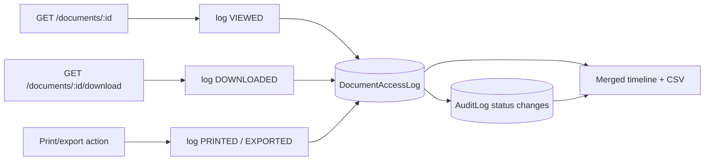

# DTMS-M4 — Access & Tracking Log

- **Status:** Implemented (Sep 2026)
- **Phase:** 1
- **Depends on:** none
- **Capabilities:** `documentsTrack` (new; ADMIN + HR_MANAGER + AUDITOR default)
- **Touches:** schema, migration, repository, service, controller, routes, permissions, middleware (download/view hooks), `Documents.jsx` (timeline), optional `Audit.jsx`

## Why
`AuditLog` records **writes** only. Reads, downloads, and prints of documents are
invisible today. CSC records management requires accounting for who accessed or
removed a record from custody. This is the cheapest module with the highest
compliance value and the least coupling (it observes; it does not change the
document workflow).

## Scope
### In
- Per-document access events (`VIEWED`, `DOWNLOADED`, `PRINTED`, `EXPORTED`).
- A merged per-document timeline: access events + status changes (from `AuditLog`).
- Tenant-scoped query + CSV export for auditors.
### Out
- User behaviour analytics / dashboards.
- Session recording.
- Retention of access logs (could later be pointed at the M5 schedule).

## Data model (migration `20260917060000_document_access_log`)
```prisma
enum DocumentAccessAction { VIEWED DOWNLOADED PRINTED EXPORTED }

model DocumentAccessLog {
  id         String              @id @default(uuid())
  tenantId   String?
  documentId String
  userId     String?
  action     DocumentAccessAction
  ip         String?
  userAgent  String?
  createdAt  DateTime            @default(now()) @db.Timestamptz(6)

  document Document @relation(fields: [documentId], references: [id], onDelete: Cascade)
  tenant   Tenant?  @relation(fields: [tenantId], references: [id])

  @@index([tenantId, documentId, createdAt])
  @@index([tenantId, userId, createdAt])
  @@index([tenantId, action, createdAt])
}
```
`tenantId` is nullable so the pre-auth public download can still be attributed to the
subdomain-resolved tenant when present. Write path is append-only and must not throw
into the request (a failed log write must never break a download) — `documentService.logAccess`
wraps the insert in `try/catch` and logs failures to stderr.

The same migration normalizes legacy `Document.url` values (`UPDATE ... regexp_replace(url,'^/+','')`)
so the DB matches the relative-path storage convention.

## API
| Method | Path | Gate | Notes |
|---|---|---|---|
| GET | `/documents/tracking` | `documentsTrack` | Tenant-wide feed; filters `documentId`, `userId`, `action`, `from`, `to`; paged (`page`/`limit`, cap 100) |
| GET | `/documents/tracking/export` | `documentsTrack` | CSV of access events (same filters, cap 5000 rows) |
| GET | `/documents/:id/tracking` | `documentsTrack` | Merged timeline (access + audit status changes), newest first |

Rows in the feed are enriched with `actor = { username, role }` (resolved via one
`User` lookup for the page) — `actor` is `null` for public downloads, which the UI
renders as "Public".

## Workflow (capture)

Capture points: the authenticated `get` and `download` controllers log inline (before
the response is written, awaited so the row is committed deterministically); a logging
failure is swallowed by the service and never affects the response. The pre-auth public
`/doc-download/:id/download` logs `DOWNLOADED` with `userId=null`.

`AuditLog` rows are written by the global middleware **without** a `tenantId`, so the
timeline scopes workflow events by the (globally unique) `documentId` with a
`tenantId ∈ {req.tenantId, null}` guard rather than `withTenant`. Tracked as drift in
`TODOS.md` (global audit middleware should stamp `tenantId`).

## UI
- `pages/DocumentsTracking.jsx` — auditor feed under the collapsible **Documents**
  sidebar group (`/documents/tracking`), filters (action + date range), paged table,
  per-document **Timeline** modal, and **Export CSV**.
- Sidebar + `CommandPalette` entries are role/capability-gated (`documentsTrack`).

## Tenant / security / audit
- Queries scoped with `withTenant`; only `documentsTrack` holders can read the feed.
- Logging never blocks the primary request; failures go to stderr + Sentry.
- No secrets stored; `userAgent`/`ip` only (ip already used by the on-premise middleware).

## Acceptance criteria
- [x] Viewing a document writes one `VIEWED` row; downloading writes `DOWNLOADED`.
- [x] Public published download writes a row with `userId = null`.
- [x] Timeline interleaves access events and status changes in time order.
- [x] A logging failure still returns the file/response successfully (service `try/catch`).
- [x] Non-`documentsTrack` roles get `403` on the feed (`EMPLOYEE` verified; `AUDITOR` allowed).
- [x] Verify gates pass (`node --check`, `npm run build`, color lint) + live E2E 16/16
      plus public-subdomain download 200/404 and null-actor logging.
