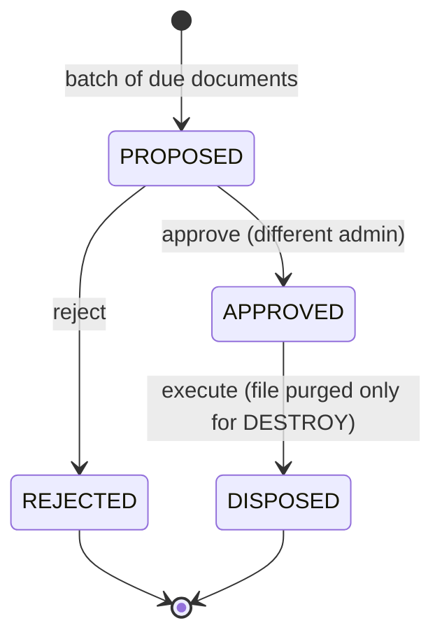

# DTMS-M5 — Retention & Disposal

- **Status:** Proposed
- **Phase:** 3
- **Depends on:** M1 (seriesCode / taxonomy)
- **Capabilities:** `retentionCRUD` (new; ADMIN manage, HR_MANAGER + AUDITOR read)
- **Touches:** schema, migration, contract, repository, service, controller, routes, permissions, `Documents.jsx` (retention fields), new `Retention` page

## Why
Government records must be kept for a defined period and disposed of only through an
approved process (CSC/NARA retention and disposal practice). Today `ARCHIVED` is
terminal with no time basis, no schedule, and no disposal authorization. This module
adds retention codes, due computation, and an approval-to-dispose workflow with a
certificate.

## Scope
### In
- Retention schedules (records series) with a retention period and disposition.
- Assign a schedule to a document; compute `retentionDueAt`.
- A "due for disposition" list and a disposal request/approval workflow.
- Disposal certificate (metadata retained even if the file is purged).
### Out
- Automated file deletion (destruction is an explicit approved action, never a cron).
- Physical transfer logistics to an archives office beyond recording the outcome.
- Legal hold / litigation hold (note as future).

## Data model (proposed Prisma)
```prisma
enum DispositionType { DESTROY TRANSFER_TO_ARCHIVES PERMANENT }
enum DisposalStatus { PROPOSED APPROVED REJECTED DISPOSED }

model RetentionSchedule {
  id             String          @id @default(uuid())
  tenantId       String
  code           String
  name           String
  description    String?
  retentionMonths Int
  disposition    DispositionType
  legalBasis     String?
  active         Boolean         @default(true)
  createdAt      DateTime        @default(now()) @db.Timestamptz(6)

  documents Document[]

  @@unique([tenantId, code])
}

model Document {
  // ...existing fields
  retentionScheduleId String?
  retentionDueAt      DateTime? @db.Date
  retentionSchedule   RetentionSchedule? @relation(fields: [retentionScheduleId], references: [id])

  @@index([tenantId, retentionDueAt])
}

model DisposalRequest {
  id           String         @id @default(uuid())
  tenantId     String
  status       DisposalStatus @default(PROPOSED)
  method       DispositionType
  requestedBy  String?
  approvedBy   String?
  approvedAt   DateTime?      @db.Timestamptz(6)
  disposedAt   DateTime?      @db.Timestamptz(6)
  certificateNo String?
  notes        String?
  createdAt    DateTime       @default(now()) @db.Timestamptz(6)

  items DisposalItem[]

  @@index([tenantId, status])
}

model DisposalItem {
  id          String @id @default(uuid())
  tenantId    String
  requestId   String
  documentId  String
  snapshot    Json   // title/type/series/retention at time of disposal

  request DisposalRequest @relation(fields: [requestId], references: [id], onDelete: Cascade)

  @@unique([requestId, documentId])
  @@index([tenantId, documentId])
}
```

## API
| Method | Path | Gate | Notes |
|---|---|---|---|
| GET/POST/PATCH | `/retention-schedules` | `retentionCRUD` | CRUD schedules; validate unique code |
| GET | `/retention/due` | `retentionCRUD` | Documents past `retentionDueAt`, not yet disposed |
| POST | `/disposals` | `retentionCRUD` | Body `{ documentIds[], method, notes }` |
| GET | `/disposals` | `retentionCRUD` | Paged list with status |
| PATCH | `/disposals/:id/approve` | ADMIN only | Requires second approver ≠ requester |
| PATCH | `/disposals/:id/reject` | ADMIN only | |
| PATCH | `/disposals/:id/dispose` | ADMIN only | Records `disposedAt`, `certificateNo`; purges file if `DESTROY` |
| GET | `/disposals/:id/certificate` | `retentionCRUD` | Renders disposal certificate (HTML/PDF) |

## Workflow

`retentionDueAt = (effectiveDate ?? createdAt) + retentionMonths`. Computed in the
service when a schedule is assigned or the document date changes, stored on the row.

## UI
- Retention fields in the document modal (schedule, computed due date).
- New **Retention & Disposal** page: schedules CRUD, due list, disposal requests, approve/reject, certificate print.
- Badge on the dashboard for upcoming/overdue disposition.

## Tenant / security / audit
- Two-person rule on disposal (requester ≠ approver); enforced server-side.
- Disposal is audited; the `DisposalItem.snapshot` preserves metadata after file purge.
- File purge only removes bytes on disk; the `Document` row and history remain.

## Acceptance criteria
- [ ] Assigning a schedule computes and stores `retentionDueAt`.
- [ ] `GET /retention/due` lists only past-due, undisposed documents for the tenant.
- [ ] Requester cannot approve their own disposal request (`403`).
- [ ] `DESTROY` purge removes the file but keeps metadata + audit trail; `TRANSFER`/`PERMANENT` keep the file.
- [ ] Certificate renders with request id, items, approver, date.
- [ ] Verify gates pass.
