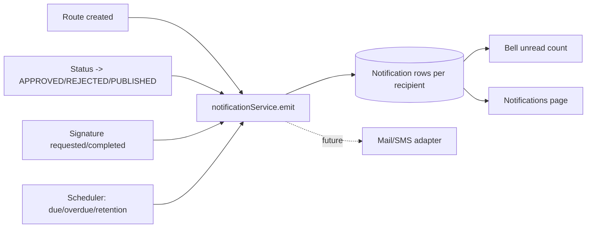

# DTMS-M6 — Notifications & Escalation

- **Status:** Proposed
- **Phase:** 3
- **Depends on:** M3 (routing), M5 (retention)
- **Capabilities:** self-scoped (no capability to read your own); emission is internal
- **Touches:** schema, migration, service (event hooks), routes, Header bell (frontend), new `Notifications` page, optional scheduler

## Why
Routing (M3) and retention (M5) are useless if nobody is told. PRIME HR notifies
assignees of pending/overdue actions; records officers need advance notice before a
retention date. This module delivers in-app notifications first (no email dependency),
with an escalation pass for overdue items.

## Scope
### In
- In-app notifications per user: route assigned, route due soon, route overdue,
  document approved/rejected/published, signature requested/completed, retention due soon.
- Unread count + bell dropdown + Notifications page.
- A periodic escalation job (reuse the biometric poller pattern) that emits due/overdue notices.
### Out
- Email/SMS delivery (future integration; keep the emitter pluggable).
- Per-user channel preferences (future).
- Push/webhooks to external systems (use existing integration webhooks if needed).

## Data model (proposed Prisma)
```prisma
enum NotificationType {
  ROUTE_ASSIGNED ROUTE_DUE_SOON ROUTE_OVERDUE
  DOC_APPROVED DOC_REJECTED DOC_PUBLISHED
  SIGNATURE_REQUESTED SIGNATURE_COMPLETED
  RETENTION_DUE
}

model Notification {
  id        String           @id @default(uuid())
  tenantId  String
  userId    String
  type      NotificationType
  title     String
  body      String?
  link      String?          // in-app route, e.g. /documents/<id>
  entityId  String?          // document/route id
  readAt    DateTime?        @db.Timestamptz(6)
  createdAt DateTime         @default(now()) @db.Timestamptz(6)

  @@index([tenantId, userId, readAt])
  @@index([tenantId, userId, createdAt])
}
```

## API
| Method | Path | Gate | Notes |
|---|---|---|---|
| GET | `/notifications` | auth (self) | Paged, newest first; `?unread=true` |
| GET | `/notifications/unread-count` | auth (self) | Bell badge |
| PATCH | `/notifications/:id/read` | auth (self) | Ownership enforced |
| POST | `/notifications/read-all` | auth (self) | |

Notification fan-out is **server-side only** — no public create endpoint.

## Workflow

Emission must be best-effort: a notification failure never fails the triggering write.

## UI
- Header bell with unread badge + dropdown (mark read, open link).
- `Notifications` page under Administration (filters by type/read).
- Escalation: overdue routes flagged in the Document Inbox (M3) as well.

## Tenant / security / audit
- Notifications are always filtered by `tenantId` + `userId`; a user can only read/update their own.
- Emitting is not an audited HTTP mutation (it is a side effect of an audited action).
- The scheduler runs single-process (same limitation as rate limiting); note for multi-instance prod.

## Acceptance criteria
- [ ] Assigning a route notifies the assignee; the bell count increments.
- [ ] A user cannot read or mark another user's notification (`404`).
- [ ] Overdue routes produce `ROUTE_OVERDUE` once (idempotent per route per day).
- [ ] Notification failure does not fail the underlying route/status action.
- [ ] Verify gates pass.
