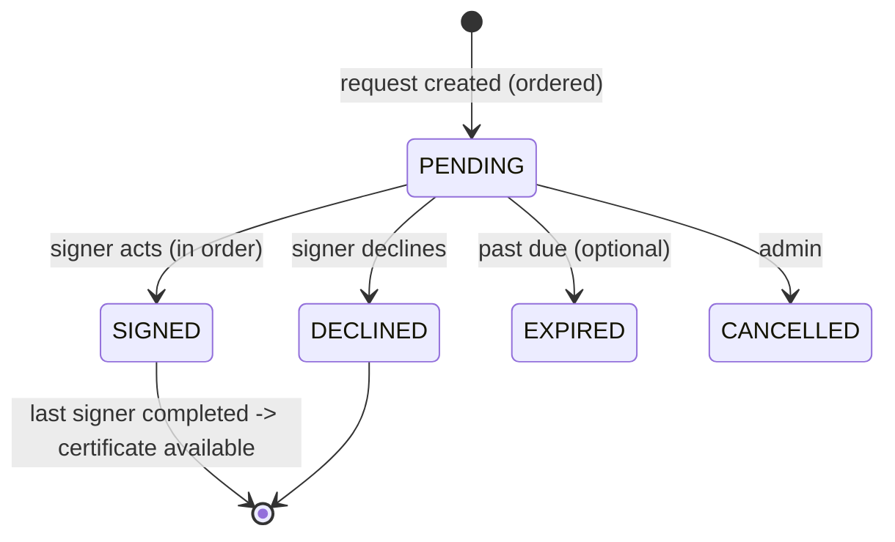

# DTMS-M7 — E-Signature

- **Status:** Proposed
- **Phase:** 4 (last — most legally sensitive)
- **Depends on:** M2 (versioning), M3 (routing)
- **Capabilities:** `documentSign` (new; ADMIN + HR_MANAGER default)
- **Touches:** schema, migration, contract, repository, service, controller, routes, permissions, `Documents.jsx` (signatures), `DocumentInbox` (sign task), new certificate renderer

## Why
Approval labels (`APPROVED`/`PUBLISHED`) do not capture **who signed**, in **what
order**, and with **what evidence**. LGU documents (office orders, MOAs, appointments)
need an ordered signing flow producing a completion certificate. PRIME HR supports
document routing/signing; this module completes the lifecycle.

## Scope
### In
- Signature requests on a specific document **version** (M2), with ordered signatories.
- Sign / decline with evidence (typed name, drawn image upload, or authenticated
  click-to-sign), capturing `signedAt`, ip, user-agent, and a hash of the signed file.
- Certificate of completion listing signatories, timestamps, and the file checksum.
### Out
- Third-party CA / PKI / DSC integration (RA 8792 recognized signature providers).
- A cryptography claim: v1 is **audit-evidence signing**, not a qualified digital signature.
- Field placement on the PDF (no x/y stamping in v1).

## Data model (proposed Prisma)
```prisma
enum SignatureStatus { PENDING SIGNED DECLINED EXPIRED CANCELLED }
enum SignatureMethod { CLICK DRAWN TYPED }

model DocumentSignature {
  id            String          @id @default(uuid())
  tenantId      String
  documentId    String
  versionId     String
  signerUserId  String
  orderNo       Int
  status        SignatureStatus @default(PENDING)
  method        SignatureMethod?
  signatureData String?         // data URL for DRAWN, or typed name
  evidenceHash  String?         // sha256 of the signed version at signing time
  requestedBy   String?
  requestedAt   DateTime        @default(now()) @db.Timestamptz(6)
  actedAt       DateTime?       @db.Timestamptz(6)
  ip            String?
  userAgent     String?
  remarks       String?

  document Document @relation(fields: [documentId], references: [id], onDelete: Cascade)

  @@unique([documentId, versionId, orderNo])
  @@index([tenantId, signerUserId, status])
  @@index([tenantId, documentId])
}
```

## API
| Method | Path | Gate | Notes |
|---|---|---|---|
| POST | `/documents/:id/signatures` | `documentSign` | Body `{ versionId, signerUserIds[] }` → ordered rows |
| GET | `/documents/:id/signatures` | auth | Current signing state |
| POST | `/documents/:id/signatures/:sigId/sign` | assignee (self) | Only when it is their turn and status PENDING |
| POST | `/documents/:id/signatures/:sigId/decline` | assignee (self) | Remarks required |
| POST | `/documents/:id/signatures/:sigId/cancel` | `documentSign` | Admin cancel |
| GET | `/documents/:id/signatures/certificate` | auth | Completion certificate (HTML, printable) |

## Workflow

Rules: only the lowest `orderNo` with `PENDING` may act; signing is blocked if the
document's active version differs from `versionId` (prevents signing a stale revision).

## UI
- "Signatures" section: signer list, order, status, sign/decline for the current user.
- Inbox (M3) surfaces `FOR_SIGNATURE` tasks; clicking opens the signing view.
- Certificate print action once all rows are `SIGNED`.

## Tenant / security / audit
- A signer may act only on their own row, in order, and only on the current version.
- Actions are audited; `evidenceHash` ties the signature to an immutable version (M2 checksum).
- Declining requires remarks; cancellation is capability-gated.
- Store `signatureData` carefully (PII) — never log it; consider size limits.

## Acceptance criteria
- [ ] Signers can only act in `orderNo` sequence; out-of-turn returns `409`.
- [ ] Signing the active version works; a superseded `versionId` is rejected.
- [ ] Decline requires remarks and notifies the requester (M6).
- [ ] Certificate lists signers, timestamps, methods, and the version checksum.
- [ ] `signatureData` never appears in logs or the audit `after` payload.
- [ ] Verify gates pass.
