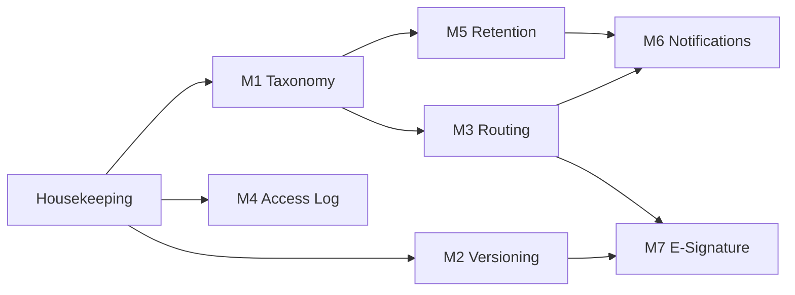

# DTMS Module Roadmap

Status: **in progress** — M4 shipped; the rest are specs. These specs decompose the
"DTMS remaining" backlog from `TODOS.md` into independently shippable modules.
The single property of the existing system (review in `src/docs/DOCUMENTS.md`)
is the baseline; everything below is additive.

## Shared decisions (apply to every module)
- **Tenancy:** every new business table carries `tenantId`; reads use `withTenant`,
  writes use `stampTenant`. Any query missing them is a tenant bug.
- **Audit:** create/update/delete flow through the global `auditLog` mount exactly
  once. Read-only tracking events (M4) are stored separately, not in `AuditLog`.
- **Capabilities:** new capabilities are added to `CAPABILITIES` + `CAPABILITY_ROUTES`
  + `DEFAULT_PERMISSIONS` (`backend/src/shared/permissions.js`) and enforced with
  `requirePermission(...)`. SUPER_ADMIN always bypasses.
- **Storage:** documents live on disk behind the API only (no static mount). Storage
  path is normalized to a relative `uploads/documents/...` value (KISS: do this in
  the housekeeping module before M2/M7 build on it).
- **Money/dates:** no money here; dates stored UTC, brokered as `YYYY-MM-DD` where
  they are calendar dates (retention/disposal).
- **Thin layers:** route = HTTP + Zod, repository = queries, service = rules.

## Modules
| ID | Module | Phase | Depends on | Capability | Spec |
|---|---|---|---|---|---|
| M1 | Taxonomy & Folders | 1 | housekeeping | `documentsCRUD` (reuse) | [01-taxonomy-and-folders.md](01-taxonomy-and-folders.md) |
| M2 | Version History | 2 | housekeeping | `documentsCRUD` (reuse) | [02-version-history.md](02-version-history.md) |
| M3 | Routing & Assignment | 2 | M1 (optional) | `documentRouting` | [03-routing-and-assignment.md](03-routing-and-assignment.md) |
| M4 | Access & Tracking Log | 1 | — | `documentsTrack` | [04-access-and-tracking-log.md](04-access-and-tracking-log.md) |
| M5 | Retention & Disposal | 3 | M1 | `retentionCRUD` | [05-retention-and-disposal.md](05-retention-and-disposal.md) |
| M6 | Notifications & Escalation | 3 | M3, M5 | (self-scoped) | [06-notifications-and-escalation.md](06-notifications-and-escalation.md) |
| M7 | E-Signature | 4 | M2, M3 | `documentSign` | [07-e-signature.md](07-e-signature.md) |
| H | Housekeeping backlog | 0 | — | — | [08-housekeeping.md](08-housekeeping.md) |

Implemented: **H (partial)** — bytes formatting, page reset, stats cards, palette
gating, relative storage path; still pending: document seed data, stale benchmark docs.
**M4** — `DocumentAccessLog` + migration, `documentsTrack`, feed/export/timeline
endpoints, capture hooks, `/documents/tracking` page (16/16 E2E).

## Dependency / sequencing

**Suggested order:** H → M4 → M1 → M2 → M3 → M5 → M6 → M7.
Rationale: housekeeping removes footguns (storage path, list shape, seed) that the
rest depend on; M4 is low-risk and high-value (visibility); M1/M2 are data-shape
work; M3 unlocks notification/signature value; M5 and M6 are policy-heavy; M7 is
the most legally sensitive and should land last.

## Reference behaviour (CSC / PRIME HR)
- Records series + retention/disposal (M1/M5) mirror CSC/NARA records management
  practice (retention codes, disposition certificates).
- Routing/signature (M3/M7) mirror PRIME HR's document routing and LGU e-signature
  flows (assigned action, ordered signatories, certificate of completion).
- Access log (M4) mirrors CSC's requirement to account for who accessed/removed a
  record from custody.
